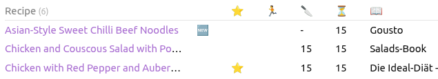

# A Dynamic Cookbook Creator with Obsidian and Claude

Using Obsidian, its dataview plugin and Claude to pull together your favourite recipes into a dynamically indexed cookbook, that lives on your own computer in a portable format, but can be shared anywhere. So you can have your cake AND eat it.



## Repository Contents

```text
cookbook-creator-with-claude-and-obsidian/
├── README.md
├── Cookbook.md          # Obsidian dynamic index — copy this into your vault
└── skills/
    └── recipe/
        └── SKILL.md     # Claude Code skill — copy this into ~/.claude/skills/recipe/
```


## Components

### Obsidian

[Obsidian](https://obsidian.md/) is a popular notetaking application in the second-brain and knowledge management community. Some of its advantages are:

* It uses markdown files. This means that you can easily move your notes somewhere else should you wish to do so. 
* Your notes live on your local device, but it has applications for all major operating systems. Since your notes are markdown, you can easily sync them across devices, giving you full control over your notes whilst having them accessible from wherever you go (even offline).
* Obsidian supports a vast ecosystem of plug-ins. 
* Obsidian supports [YAML frontmatter](https://frontmatter.codes/docs/markdown) and lets you query it using its [dataview query language (DQL)](https://blacksmithgu.github.io/obsidian-dataview/queries/structure/). YAML frontmatter are metadata blocks at the top of your files, where you can define tags and other metadata properties. The DQL then allows us to dynamically query our note metadata as if it was information in a database, creating dynamically self-updating tables and lists.

The last point is what we will exploit for our cookbook. The cookbook consists of a simple folder that contains recipes which are tagged with `#recipe` plus any other recipe property we are interested in. We then create a cookbook main page, that pulls together a dynamic view of all recipes and their properties.

### Claude + Recipe Skill

Recipes typically come from a wide range of sources, from handwritten notes over photos of cookbook pages to online posts. If you are multilingual, they might even come in different languages. Standardizing them into a single format is cumbersome. Here, we use a [Claude Code](claude.ai/code) skill to:

* Parse image data into text data.
* Translate recipes to English.
* Standardize the input recipe data and convert it into a structured markdown file according to pre-defined template.
* Identify and apply the appropriate tags necessary to fuel Obsidians DQL. 

Note that whilst this repository contains the skill file for Claude, the same principle can easily be applied to other LLMs.

## Building the Cookbook

### Prerequisites

* [Obsidian](https://obsidian.md/) installed
* [Claude Code](https://claude.ai/code) installed 

### Setup

To setup your cookbook:

1. Activate Obsidian's Dataview community plugin.
2. Create a new Obsidian vault (or use an existing one).
3. Copy `Cookbook.md` from this repository into your vault (your vault is all of the information present in Obsidian).
4. Copy `skills/recipe/SKILL.md` from this repository into `~/.claude/skills/recipe/SKILL.md`. This registers it as a [Claude Code skill](https://docs.anthropic.com/en/docs/claude-code/skills) — a reusable prompt template that Claude will apply automatically when you ask it to format a recipe.

That's it. You are all set to add recipes into your vault.

### Adding Recipes using the Claude Recipe Skill

To use Claude's new recipe skill:

1. Start a Claude Code conversation and give it your recipe source — paste in text from a webpage, attach a photo of a cookbook page, or type out your own notes. Then ask Claude to format it as a recipe, e.g. *"Convert this into a recipe file."*
2. Save the resulting file in your Obsidian vault. As long as it has the `recipe` tag, `Cookbook.md` will pick it up automatically.

## Recipe File Format

Every recipe follows this structure:

```yaml
---
tags:
- recipe
- <category tag(s), e.g. breakfast, salad, soup, stew, vegetable, chicken, meat, fish, pasta, dessert>
- <vegetarian if vegetarian>
- new
serves: <number>
preptime: <number of minutes>
cooktime: <number of minutes>
source: <book or website name>
---

## Ingredients

- [ ] <ingredient 1>
- [ ] <ingredient 2>
…

## Comments

<Any notes, tips, or description about the dish. If none provided, omit this section entirely.>

## Steps

1. <Step 1>
2. <Step 2>

## Per Serving

<Only included if nutritional information is available in the source; omit this section otherwise.>

* <number> kcal
* <number>g protein
* <number>g fat
* <number>g carbohydrates
…
```

## Tag Reference

- **Category**: Used to sort recipes into categories within the cookbook. Add more as needed.
- **Vegetarian**: Flags whether a recipe is vegetarian.
- **Other Tags**: 
    * `new`: Newly added, not yet tried recipe.
    * `quick`: Extra speedy recipe.
    * `favourite`: Personal favourite recipe that gets an extra flag in the cookbook.

The more consistently you tag, the better your cookbook filters.


## The Cookbook Index

`Cookbook.md` is a dynamic index that automatically queries all your recipes. When you drop a recipe into your Obsidian vault, it gets added automatically to the appropriate section (given it has the right tags).

The cookbook index is organized into sections by either category (Breakfasts, Salads, Soups, etc.) or source with additional columns showing:

- **Recipe Name**: links to the recipe file
- **🆕**: appears if the recipe has the `new` tag
- **⭐**: appears if the recipe has the `favourite` tag
- **🏃**: appears if the recipe has the `quick` tag
- **🥕**: appears if the recipe is `vegetarian`
- **🔪**: prep time in minutes
- **⏳**: total cook time (prep + cook)
- **📖**: source book or website

### By Category

Each section runs a Dataview query and produces a table containing all recipes with the given category tag as well as additional information based on the additional tags described above.

Categories refer to types of meals, e.g. `Breakfast`, `Salad`, `Soup/Stew`, `Fish`, etc.

### By Source

In addition to sorting by recipe category, you can also filter your recipes by source — useful if you have many recipes from a particular book or website. The included `Cookbook.md` has a section for Hugh Fearnley-Whittingstall's *Much More Veg* as an example — replace it with whichever sources work best for you, or delete this section altogether.

## Customizing & Extending

### Customizing Categories

Want to add a new category (e.g., "Desserts", "Appetizers")?

Add a new section to `Cookbook.md` with a Dataview query:

````markdown
## Desserts

```dataview
TABLE WITHOUT ID file.link as "Recipe", (choice(contains(tags, "new"), "🆕", "")) as "", ...
FROM #recipe AND #dessert
SORT file.name asc
```
````

Then tag new recipes with `#dessert` and they'll appear automatically. Add the tag name to your Claude skill prompt or apply it manually.

### Creating Custom Queries

Dataview is flexible, so use it to create the queries that work best for your interest. Some ideas:

- Quick weeknight dinners (filter by `quick` + `favourite`)
- Seasonal recipes (add a `season` tag and query by it)
- Recipes below xxx kcal or with more than xxx g protein.